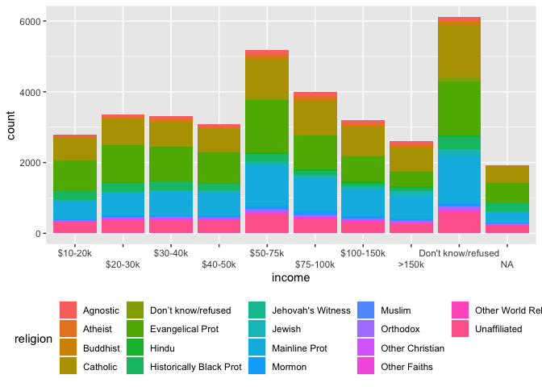

HMK 8: summarizing, reshaping, merging
================

# Q1: Summarizing operations and exploratory data analysis

## Q1a

Download `experiment1.csv` from Canvas (under files). This reports two
variables from an experiment that has four treatments. Creatively, the
treatments are `1`, `2`, `3`, and `4`, and the two variables are `x` and
`y`.

Create a data frame that contains the mean, standard deviation, and
number of points for each treatment. You will want to use functions like
`summarise()`, `group_by()`, `mean()`, and `sd()`.

- **I have to first load the .csv file into R and assign it to an
  object. I can then begin to make the data frames for the different
  functions as stated above.**

``` r
library(tidyverse)
ex1.DF <- read.csv("experiment1.csv")

glimpse(ex1.DF)
```

    Rows: 44
    Columns: 3
    $ balls <int> 1, 2, 3, 4, 1, 2, 3, 4, 1, 2, 3, 4, 1, 2, 3, 4, 1, 2, 3, 4, 1, 2…
    $ x     <int> 10, 10, 10, 8, 8, 8, 8, 8, 13, 13, 13, 8, 9, 9, 9, 8, 11, 11, 11…
    $ y     <dbl> 8.04, 9.14, 7.46, 6.58, 6.95, 8.14, 6.77, 5.76, 7.58, 8.74, 12.7…

``` r
ex1.DF.meanX <- 
  ex1.DF %>% group_by(balls) %>% summarise(mean_balls_x = mean(x)) 

ex1.DF.meanY <- 
  ex1.DF %>% group_by(balls) %>% summarise(mean_balls_y = mean(y)) 

ex1.DF.total_mean <- inner_join(ex1.DF.meanX, ex1.DF.meanY, by="balls")

ex1.DF.sdX <-
  ex1.DF %>% group_by(balls) %>% summarise(sd_balls_x = sd(x))

ex1.DF.sdY <-
  ex1.DF %>% group_by(balls) %>% summarise(sd_balls_y = sd(y))

ex1.DF.total_sd <- inner_join(ex1.DF.sdX, ex1.DF.sdY, by="balls")

ex1.DF.point_number <-
  ex1.DF %>% group_by(balls) %>% count(balls)

ex1.DF.joint_mean_sd <- inner_join(ex1.DF.total_mean, ex1.DF.total_sd, by="balls")

ex1.DF.total <- inner_join(ex1.DF.joint_mean_sd, ex1.DF.point_number, by="balls")                                      

head(ex1.DF.total)
```

    # A tibble: 4 × 6
      balls mean_balls_x mean_balls_y sd_balls_x sd_balls_y     n
      <int>        <dbl>        <dbl>      <dbl>      <dbl> <int>
    1     1            9         7.50       3.32       2.03    11
    2     2            9         7.50       3.32       2.03    11
    3     3            9         7.5        3.32       2.03    11
    4     4            9         7.50       3.32       2.03    11

Are the data sets different in any important way?

- The means and sd between x and y differ by a bit, but not by much. The
  sd differs by around 1.3 and the mean differs by around 2.5.

## Q1b

Now load the file `experiment2.csv`. Again, this describes two variables
for multiple treatments (here called `dataset`). Answer the same
questions as above.

- **I will do the same steps as I did above only this time using the
  data from experiment 2.**

``` r
library(tidyverse)

ex2.DF <- read.csv("experiment2.csv")

glimpse(ex2.DF)
```

    Rows: 1,846
    Columns: 3
    $ dataset <chr> "dino", "dino", "dino", "dino", "dino", "dino", "dino", "dino"…
    $ x       <dbl> 55.3846, 51.5385, 46.1538, 42.8205, 40.7692, 38.7179, 35.6410,…
    $ y       <dbl> 97.1795, 96.0256, 94.4872, 91.4103, 88.3333, 84.8718, 79.8718,…

``` r
ex2.DF.meanX <- 
  ex2.DF %>% group_by(dataset) %>% summarise(mean_dataset_x = mean(x)) 

ex2.DF.meanY <-     
  ex2.DF %>% group_by(dataset) %>% summarise(mean_dataset_y = mean(y)) 

ex2.DF.total_mean <- inner_join(ex2.DF.meanX, ex2.DF.meanY, by="dataset")

ex2.DF.sdX <-
  ex2.DF %>% group_by(dataset) %>% summarise(sd_dataset_x = sd(x))

ex2.DF.sdY <-
  ex2.DF %>% group_by(dataset) %>% summarise(sd_dataset_y = sd(y))

ex2.DF.total_sd <- inner_join(ex2.DF.sdX, ex2.DF.sdY, by="dataset")

ex2.DF.point_number <-
  ex2.DF %>% group_by(dataset) %>% count(dataset)


ex2.DF.joint_mean_sd <- inner_join(ex2.DF.total_mean, ex2.DF.total_sd, by="dataset")

ex2.DF.total <- inner_join(ex2.DF.joint_mean_sd, ex2.DF.point_number, by="dataset")                                      

head(ex2.DF.total)
```

    # A tibble: 6 × 6
      dataset  mean_dataset_x mean_dataset_y sd_dataset_x sd_dataset_y     n
      <chr>             <dbl>          <dbl>        <dbl>        <dbl> <int>
    1 away               54.3           47.8         16.8         26.9   142
    2 bullseye           54.3           47.8         16.8         26.9   142
    3 circle             54.3           47.8         16.8         26.9   142
    4 dino               54.3           47.8         16.8         26.9   142
    5 dots               54.3           47.8         16.8         26.9   142
    6 h_lines            54.3           47.8         16.8         26.9   142

Are the data sets different in any important way?

- It is weird that the means and standard deviations for both x and y in
  each dataset are roughly the same.

# Q2: pivoting

Create a plot that illustrates the differences in income among
religions, using the `relig_income` data set that is built into
tidyverse.

You will need to create a tidy data frame to do this.

``` r
library(tidyverse)

relig_income_long <- relig_income %>% 
  pivot_longer(!religion, names_to = "income", values_to = "count") %>%
  group_by(religion)

relig_income_long$income <- factor(relig_income_long$income, levels = c("<$10K", "$10-20k", "$20-30k", "$30-40k", "$40-50k", "$50-75k", "$75-100k", "$100-150k", ">150k", "Don't know/refused" ))


ggplot(data = relig_income_long, aes(x = income, y = count, fill = religion)) +
  geom_col() +
  scale_x_discrete(guide = guide_axis(n.dodge = 2)) + 
  theme(legend.position = "bottom")
```



# Q3: merging

## Q3a: meaning of joins

Explain the difference between a left join, a right join, an inner join,
and an outer join.

- left join: this keeps the observations from the x table

- right join: this keeps the observations from the y table

- inner join: this matches pairs of equal observations among other
  tables

- outer join: right and left joins are types of outer joins

## Q3b: using joins

Using the `flights` and `weather` data sets from `nycflights13`,
determine whether there is a correlation between average hourly wind
speed and departure delays at NY airports.

This is a question about joins: you will need to join the `flights` and
`weather` by year, month, day, and hour. However, note that `flights`
has encoded departure time in a particularly annoying way: as an
integers. For instance, the integer 517 indicates 5:17 am.

`weather` gives average weather conditions each hour, with the hour
given as an integer (e.g., 5 indicating 5-6 am). You’re going to have to
figure out how to convert the time in `flights` into a form that matches
the form in `weather`.

If you want, you can use the `lm()` function to make a linear model of
departure delay as a function of wind speed. But it is also fine to just
make a plot of the two variables with `geom_smooth()`.

``` r
library(tidyverse)
library(nycflights13)
```
