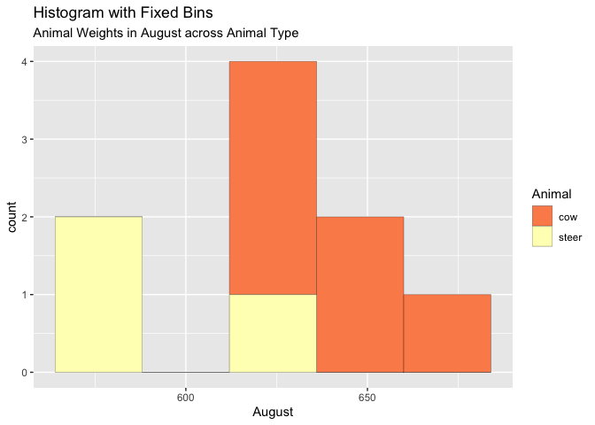

Homework 4
================
Beatrice Caiado

# Homework 4

## Creating a ggplot of own data

- We have to first load tidy verse and then we have to load in our .csv
  file so R knows where to look for our data.

``` r
library(tidyverse)
cows <- read.csv("cow_weights.csv")
```

- Now we can create a ggplot based on our data. I am choosing to use a
  histogram with fixed bins.

``` r
g <- ggplot(cows, aes(August)) + scale_fill_brewer(palette = "Spectral")

g + geom_histogram(aes(fill=Animal), 
                   bins=5, 
                   col="black", 
                   size=.1) +  
  labs(title="Histogram with Fixed Bins", 
       subtitle="Animal Weights in August across Animal Type")
```



- **This histogram is looking at animal types, cow and steer, and what
  their weights were in the month of August. This graph is maybe not the
  best for this type of information because it groups the weights of
  multiple animals that are in that weight group. It doesn’t exactly say
  the exact weight of each animal. For this information, I would think a
  type of scatter plot would be better, but this is a different way of
  expressing the data.**
