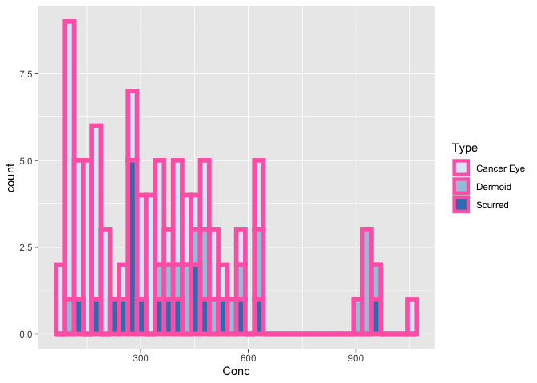
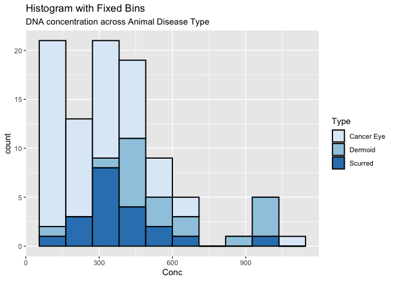

hmk_06
================
Beatrice Caiado

# BADPLOT

Here I took some of project data and creatd a bad histogram
representation of it.

``` r
library(tidyverse)
cows <- read.csv("~/Beatrice C. MICR_575/hmk/Bsamp.csv", header = TRUE)
```

``` r
g <- ggplot(cows, aes(Conc)) + scale_fill_brewer(palette = "Blues")

g + geom_histogram(aes(fill=Type), 
                   bins=40, 
                   col="hotpink", 
                   size=2)
```



## Citations and Reasons

“Because histograms are generated by binning the data, their exact
visual appearance depends on the choice of the bin width.” -Wilke, 7.1
\* The histogram that I created goes against this quote because I put
too many bins in my plot. I put 40 bins and that is too many and makes
it hard to read.

“Such a scale contains a finite set of specific colors that are chosen
to look clearly distinct from each other while also being equivalent to
each other. The second condition requires that no one color should stand
out relative to the others. And, the colors should not create the
impression of an order, as would be the case with a sequence of colors
that get successively lighter.” -Wilke, 4.1 \* In this case, I do use a
spectrum of blues that do go from dark to light. However, the lighter
blue almosr blends into the background of the graph and becomes hard to
see. The thick hotpink background also doesn’t help the fact that you
can hardly see the light blue now. The hotpink color stands out
drastically against the blue colors. This distracts they eye
tremendously.

“One commonly employed visualization strategy in this case is a stacked
histogram, where we draw the histogram bars for women on top of the bars
for men, in a different color.In my opinion, this type of visualization
should be avoided. There are two key problems here: First, from just
looking at the figure, it is never entirely clear where exactly the bars
begin. Second, the bar heights for the female counts cannot be directly
compared to each other, because the bars all start at a different
height.” -Wilke, 7.2 \* My histogram does exactly what Wilke says not to
do. It stacks three different types of data into one bin which is worse
than the example he gave in his book. It is hard to tell where what type
of data starts and ends because they are stacked. We can also never
compare lets say the Cancer Eye samples to each other across bins
because they don’t start at the same height and point.

- There is no labeling on the chart at all. Anyone who sees this chart
  will have no idea what it’s about and what type of information it is
  trying to display.

**The graph below is better than the original one becuase I fixed the
border colors and I added labels. However, it is still stacked, so it is
still not the best representation.**

``` r
g <- ggplot(cows, aes(Conc)) + scale_fill_brewer(palette = "Blues")

g + geom_histogram(aes(fill=Type), 
                   bins=10, 
                   col="black", 
                   size=.7) +  
  labs(title="Histogram with Fixed Bins", 
       subtitle="DNA concentration across Animal Disease Type")
```


