Hmk_07
================
Beatrice

``` r
library(tidyverse)
glimpse(diamonds)
```

    Rows: 53,940
    Columns: 10
    $ carat   <dbl> 0.23, 0.21, 0.23, 0.29, 0.31, 0.24, 0.24, 0.26, 0.22, 0.23, 0.…
    $ cut     <ord> Ideal, Premium, Good, Premium, Good, Very Good, Very Good, Ver…
    $ color   <ord> E, E, E, I, J, J, I, H, E, H, J, J, F, J, E, E, I, J, J, J, I,…
    $ clarity <ord> SI2, SI1, VS1, VS2, SI2, VVS2, VVS1, SI1, VS2, VS1, SI1, VS1, …
    $ depth   <dbl> 61.5, 59.8, 56.9, 62.4, 63.3, 62.8, 62.3, 61.9, 65.1, 59.4, 64…
    $ table   <dbl> 55, 61, 65, 58, 58, 57, 57, 55, 61, 61, 55, 56, 61, 54, 62, 58…
    $ price   <int> 326, 326, 327, 334, 335, 336, 336, 337, 337, 338, 339, 340, 34…
    $ x       <dbl> 3.95, 3.89, 4.05, 4.20, 4.34, 3.94, 3.95, 4.07, 3.87, 4.00, 4.…
    $ y       <dbl> 3.98, 3.84, 4.07, 4.23, 4.35, 3.96, 3.98, 4.11, 3.78, 4.05, 4.…
    $ z       <dbl> 2.43, 2.31, 2.31, 2.63, 2.75, 2.48, 2.47, 2.53, 2.49, 2.39, 2.…

\##Question 1: In the diamonds data set, some of the values are almost
certainly bad (although it is not possible to be 100% sure which ones
are bad and which are valid).

``` r
ggplot(diamonds) + 
  geom_histogram(mapping = aes(x = z), binwidth = 0.5) +
  coord_cartesian(ylim = c(0, 50))
```

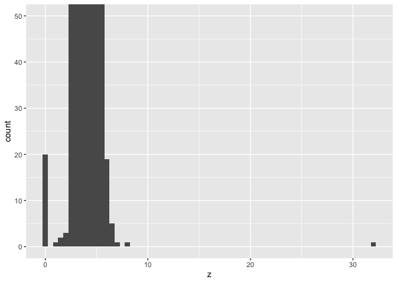

1.  Identify data that seem bad

- When looking at the column z and after graphing it, there seems to be
  an outlier that doesn’t make sense with the rest of the data.

2.  Explain why you think they are bad

- Outliers can have an effect on the data, so it is important that we
  get rid of them.

3.  Create a data frame with bad data excluded

``` r
good_df <- diamonds %>% 
  filter(z >= 0 | z <=10) %>% 
  select(price, x, y, z) %>%
  arrange(z)
```

## 7.3.4 Exercise

1.Explore the distribution of each of the x, y, and z variables in
diamonds. What do you learn? Think about a diamond and how you might
decide which dimension is the length, width, and depth.

- To start this, I will calculate the summary statistics for each of the
  variables and plot their distributions.

``` r
summary(select(diamonds, x, y, z))
```

           x                y                z         
     Min.   : 0.000   Min.   : 0.000   Min.   : 0.000  
     1st Qu.: 4.710   1st Qu.: 4.720   1st Qu.: 2.910  
     Median : 5.700   Median : 5.710   Median : 3.530  
     Mean   : 5.731   Mean   : 5.735   Mean   : 3.539  
     3rd Qu.: 6.540   3rd Qu.: 6.540   3rd Qu.: 4.040  
     Max.   :10.740   Max.   :58.900   Max.   :31.800  

``` r
ggplot(diamonds) +
  geom_histogram(mapping = aes(x = x), binwidth = 0.1)
```


``` r
ggplot(diamonds) +
  geom_histogram(mapping = aes(x = y), binwidth = 0.1)
```

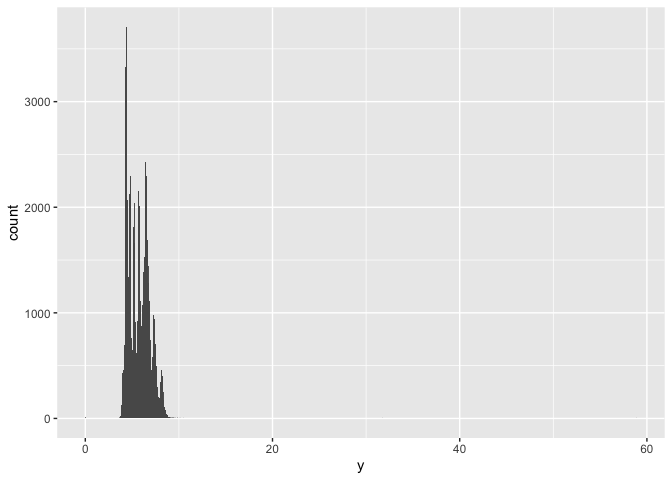

``` r
ggplot(diamonds) +
  geom_histogram(mapping = aes(x = z), binwidth = 0.1)
```

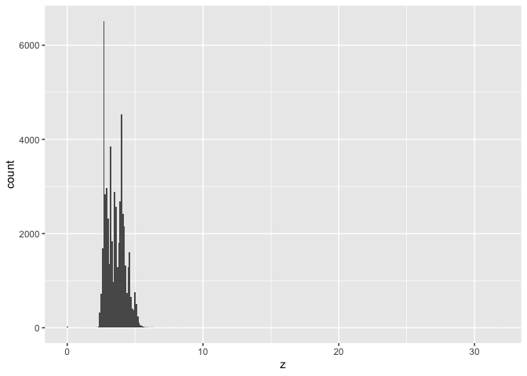

- From the three different graphs, I notice that all of them have
  outliers, x and y set are larger than z, and they are all right
  skewed. The two types of outliers are when a diamond has a value of 0
  or it has a value that is extremely large and not proportionate. With
  the outliers in y and z, I have to assume that they are incorrect data
  entry because those values have nothing to do with the other values
  that were input.

- We know that in this data set x is length, y is width, and z is depth.
  If I didn’t have this information, I could attempt to figure out what
  is what. I know that length will be smaller than the width and depth
  should be smaller than both length and width. I can calculate it by
  using `mean()`.

``` r
summarise(diamonds, mean(x > y), mean(x > z), mean(y > z))
```

    # A tibble: 1 × 3
      `mean(x > y)` `mean(x > z)` `mean(y > z)`
              <dbl>         <dbl>         <dbl>
    1         0.434          1.00          1.00

2.  Explore the distribution of price. Do you discover anything unusual
    or surprising? (Hint: Carefully think about the binwidth and make
    sure you try a wide range of values.)

- To look at distribution, I can create a histogram looking at the
  distribution of diamond prices up to \$5000 and then alter the bin
  widths.

``` r
ggplot(filter(diamonds, price < 5000), aes(x = price)) +
  geom_histogram(binwidth = 10)
```

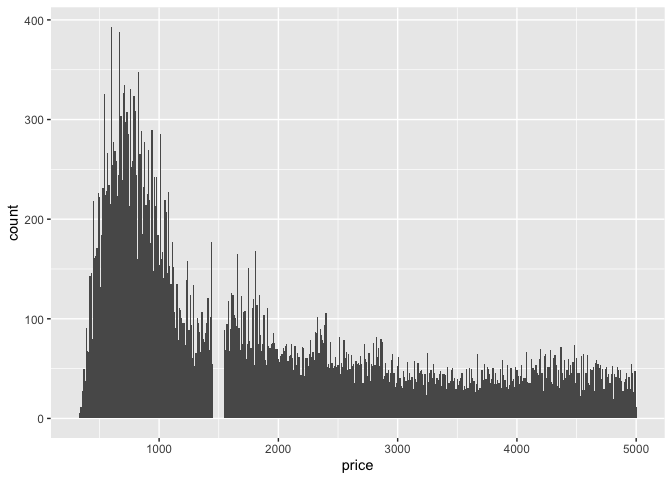

``` r
ggplot(filter(diamonds, price < 5000), aes(x = price)) +
  geom_histogram(binwidth = 20)
```

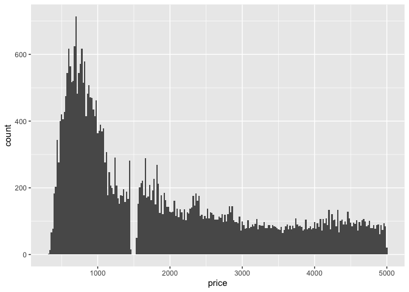

``` r
ggplot(filter(diamonds, price < 5000), aes(x = price)) +
  geom_histogram(binwidth = 100)
```

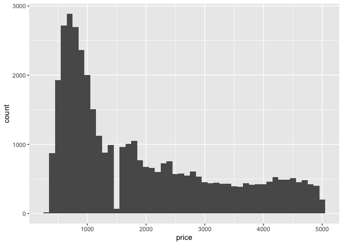

- Looking at this distribution, there are a lot more diamonds in the
  lower price range either below \$1000 or right above. There are no
  diamonds with a price of \$1500. I think that using a bin width of 10
  is the most efficient one because you can see the spikes more clearly
  and tell that the price has more diamonds associated with it and also
  there could be many diamonds with one price, but a price that is a
  dollar higher could have no diamonds and this bin width allows us to
  see that change better.

3.  How many diamonds are 0.99 carat? How many are 1 carat? What do you
    think is the cause of the difference?

- In order to answer this, I have to filter the data to see how many
  diamonds are each carat. The number of diamonds that are 0.99 carats
  are 23 and the number of diamonds that are 1 carat are 1558. I think
  that the cause of the difference is that it is easier to classify a
  diamond as 1 carat because it is a whole number while to classify a
  diamond as 0.99 carats is harder because it is easier to classify it
  as 1. There could also be a premium for a 1 carat diamond making the
  price change.

``` r
nine_carat <- diamonds %>%
  filter(carat == 0.99)
glimpse(nine_carat)
```

    Rows: 23
    Columns: 10
    $ carat   <dbl> 0.99, 0.99, 0.99, 0.99, 0.99, 0.99, 0.99, 0.99, 0.99, 0.99, 0.…
    $ cut     <ord> Fair, Fair, Fair, Fair, Fair, Very Good, Good, Premium, Ideal,…
    $ color   <ord> I, J, J, I, H, J, F, F, I, E, F, G, D, F, H, D, F, F, F, F, F,…
    $ clarity <ord> SI2, SI1, SI1, SI1, VS2, SI1, SI2, SI2, SI1, SI2, SI2, SI1, SI…
    $ depth   <dbl> 68.1, 55.0, 58.0, 60.7, 71.6, 60.3, 63.3, 60.6, 61.8, 61.8, 61…
    $ table   <dbl> 56, 61, 67, 66, 57, 57, 54, 61, 57, 59, 56, 56, 57, 58, 56, 57…
    $ price   <int> 2811, 2812, 2949, 3337, 3593, 4002, 4052, 4075, 4763, 4780, 48…
    $ x       <dbl> 6.21, 6.72, 6.57, 6.42, 5.94, 6.44, 6.36, 6.45, 6.40, 6.30, 6.…
    $ y       <dbl> 6.06, 6.67, 6.50, 6.34, 5.80, 6.49, 6.43, 6.38, 6.42, 6.33, 6.…
    $ z       <dbl> 4.18, 3.68, 3.79, 3.87, 4.20, 3.90, 4.05, 3.89, 3.96, 3.90, 3.…

``` r
one_carat <- diamonds %>%
  filter(carat == 1)
glimpse(one_carat)
```

    Rows: 1,558
    Columns: 10
    $ carat   <dbl> 1, 1, 1, 1, 1, 1, 1, 1, 1, 1, 1, 1, 1, 1, 1, 1, 1, 1, 1, 1, 1,…
    $ cut     <ord> Premium, Premium, Fair, Fair, Premium, Fair, Premium, Fair, Fa…
    $ color   <ord> I, J, G, J, H, H, F, G, I, H, I, H, H, J, I, H, H, I, H, H, E,…
    $ clarity <ord> SI2, SI2, I1, VS2, I1, SI2, I1, SI2, SI1, SI2, SI2, SI1, SI2, …
    $ depth   <dbl> 58.2, 62.3, 66.4, 65.7, 61.3, 65.3, 58.9, 67.8, 67.9, 66.1, 61…
    $ table   <dbl> 60, 58, 59, 59, 60, 62, 60, 61, 62, 56, 56, 62, 60, 55, 61, 55…
    $ price   <int> 2795, 2801, 2808, 2811, 2818, 2818, 2841, 2856, 2856, 2856, 28…
    $ x       <dbl> 6.61, 6.45, 6.16, 6.14, 6.43, 6.34, 6.60, 5.96, 6.19, 6.21, 6.…
    $ y       <dbl> 6.55, 6.34, 6.09, 6.07, 6.39, 6.12, 6.55, 5.90, 6.03, 5.97, 6.…
    $ z       <dbl> 3.83, 3.98, 4.07, 4.01, 3.93, 4.08, 3.87, 4.02, 4.15, 4.04, 3.…

4.  Compare and contrast coord_cartesian() vs xlim() or ylim() when
    zooming in on a histogram. What happens if you leave binwidth unset?
    What happens if you try and zoom so only half a bar shows?

\*The `coord_cartesian()` function zooms in on the area specified by the
limits and after plotting and calculating bins. Since the histogram bins
have already been calculated, they are unaffected.

``` r
ggplot(diamonds) +
  geom_histogram(mapping = aes(x = price)) +
  coord_cartesian(xlim = c(100, 6000), ylim = c(0, 3000))
```

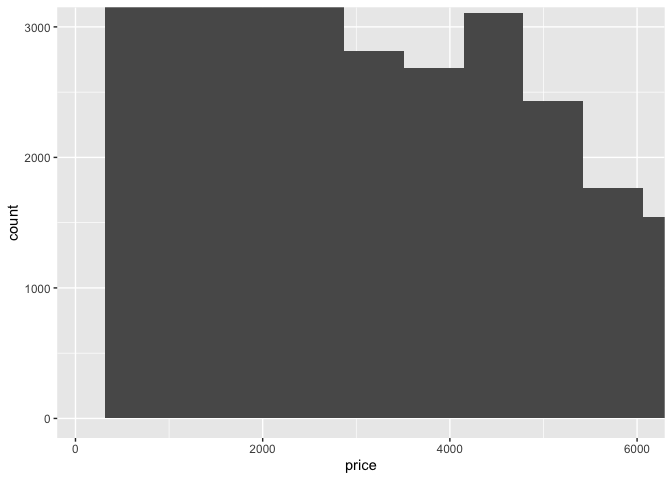

- The `xlim()` and `ylim()` functions influence anything before the
  calculations related to the histogram. So any values outside the x-
  and y-limits are dropped before calculating bin widths and counts and
  this can influence how the histogram looks.

``` r
ggplot(diamonds) +
  geom_histogram(mapping = aes(x = price)) +
  xlim(100, 6000) +
  ylim(0, 3000)
```

    Warning: Removed 11551 rows containing non-finite values (stat_bin).

    Warning: Removed 5 rows containing missing values (geom_bar).

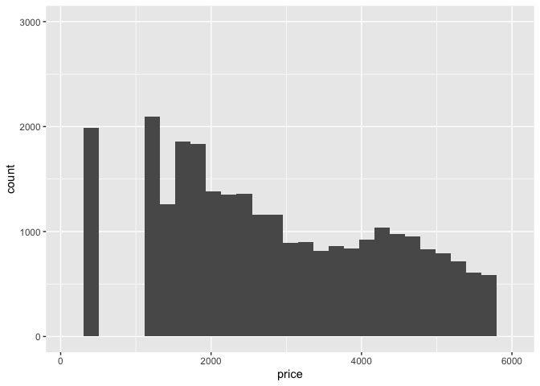

## 7.4.1 Exercise

1.  What happens to missing values in a histogram? What happens to
    missing values in a bar chart? Why is there a difference?

- Missing values are removed when the number of observations in each bin
  are calculated. A warning pops up saying how many rows with non-finite
  values were removed.

``` r
diamonds2 <- diamonds %>%
  mutate(y = ifelse(y < 3 | y > 30, NA, y))

ggplot(diamonds2, aes(x = y)) +
  geom_histogram()
```

    Warning: Removed 9 rows containing non-finite values (stat_bin).

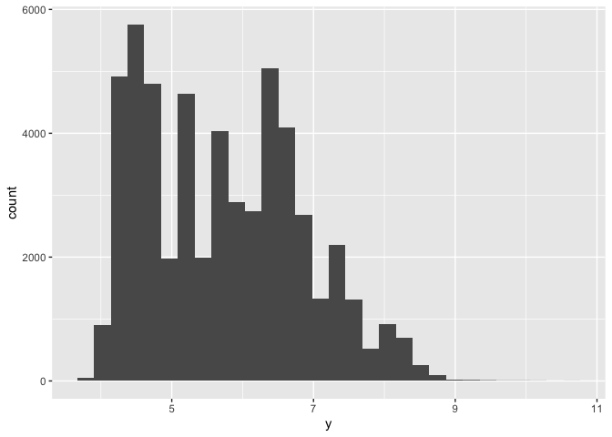

- In the `geom_bar()` function, NA acts as another category. The x
  aesthetic in `geom_bar()` requires a discrete categorical variable,
  and the NA values act like another category.

``` r
diamonds %>%
  mutate(cut = if_else(runif(n()) < 0.1, NA_character_, as.character(cut))) %>%
  ggplot() +
  geom_bar(mapping = aes(x = cut))
```

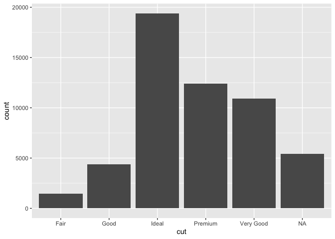

2.  What does na.rm = TRUE do in mean() and sum()?

- Using this removes the NA values from the vector before the mean and
  sum are calculated.

``` r
mean(c(0, 1, 2, NA), na.rm = TRUE)
```

    [1] 1

``` r
sum(c(0, 1, 2, NA), na.rm = TRUE)
```

    [1] 3

## 7.5.3.1 Exercise

1.  Instead of summarizing the conditional distribution with a box plot,
    you could use a frequency polygon. What do you need to consider when
    using `cut_width()` vs `cut_number()`? How does that impact a
    visualization of the 2d distribution of carat and price?

- Both `cut_width()` and `cut_number()` split a variable into groups.
  When using `cut_width()`, we need to specify the width, and the number
  of bins will be automatically calculate. When using `cut_number()`, we
  need to tell it the number of bins, and the widths will be
  automatically calculated. We need to make sure that the number of bins
  and the width are proportionate for our observations. If we decide to
  use colors for categories, we shouldn’t use more than eight so that we
  are able to distinctly identify them. Using cut_number, I will split
  carats into groups.

``` r
ggplot(
  data = diamonds,
  mapping = aes(color = cut_number(carat, 5), x = price)
) +
  geom_freqpoly() +
  labs(x = "Price", y = "Count", color = "Carat")
```

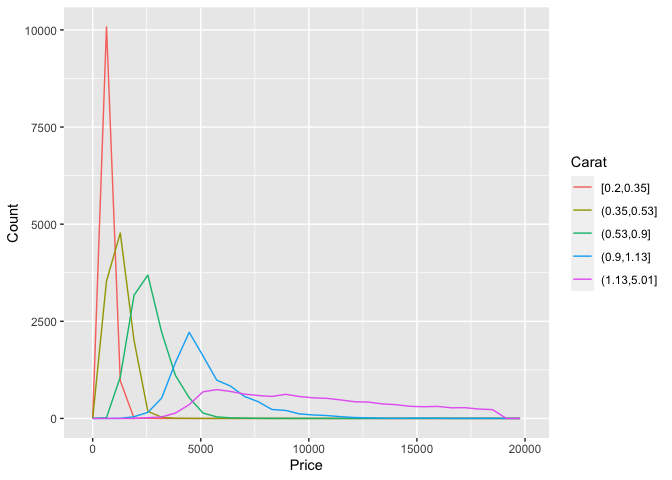

- I can also use cut_width to specify widths that I want to cut. I will
  choose 1.5-carat widths.

``` r
ggplot(
  data = diamonds,
  mapping = aes(color = cut_width(carat, 1.5, boundary = 0), x = price)
) +
  geom_freqpoly() +
  labs(x = "Price", y = "Count", color = "Carat")
```

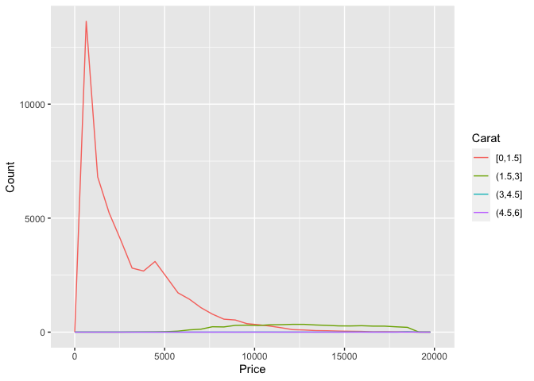

2.  Visualize the distribution of carat, partitioned by price.

- I will plot this with a box plot with 10 bins with an equal number of
  observations, and the width determined by the number of observations.

``` r
ggplot(diamonds, aes(x = cut_number(price, 10), y = carat)) +
  geom_boxplot() +
  coord_flip() +
  xlab("Price")
```

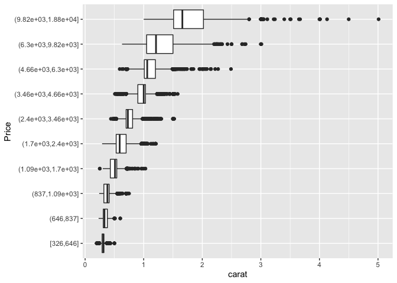

- I will plot box plot with 10 equal-width bins of \$2,000 and the
  argument `boundary = 0` makes sure that the first bin is \$0–\$2,000.

``` r
ggplot(diamonds, aes(x = cut_width(price, 2000, boundary = 0), y = carat)) +
  geom_boxplot(varwidth = TRUE) +
  coord_flip() +
  xlab("Price")
```

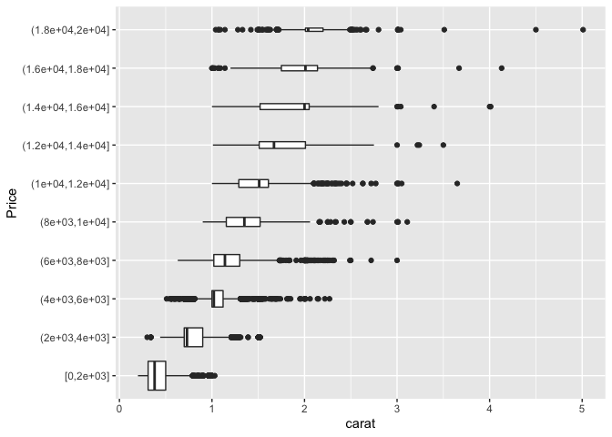

3.  How does the price distribution of very large diamonds compare to
    small diamonds? Is it as you expect, or does it surprise you?

``` r
ggplot(diamonds, mapping = aes(x=price, y=carat)) +
  geom_point()
```

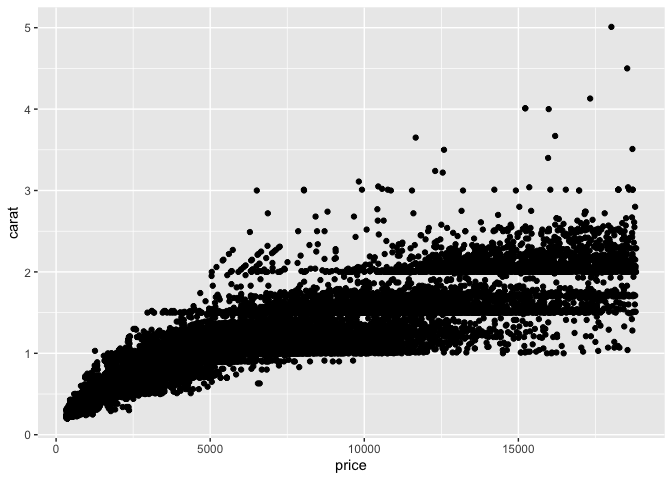

- The distribution of very large diamonds is more variable. I would
  guess that this is due to the way in which diamonds are selected for
  being sold in stores. Most stores choose diamonds that meet certain
  requirements. In order for a smaller diamond to be worth it, they have
  to be perfect in every other category like clarity, cut, etc. That is
  why there are smaller diamonds that sell for much higher prices as
  well. Larger diamonds can still sell for a lot of money even though
  their clarity, cut, etc might not be that great. That is why larger
  diamonds have more variability in price.

4.  Combine two of the techniques you’ve learned to visualize the
    combined distribution of cut, carat, and price.

``` r
ggplot(diamonds, aes(colour = cut_number(carat, 4), y = price, x = cut)) +
  geom_boxplot()
```

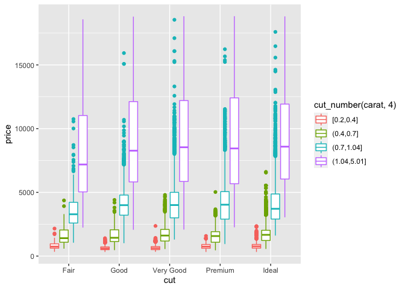

5.  Two dimensional plots reveal outliers that are not visible in one
    dimensional plots. For example, some points in the plot below have
    an unusual combination of x and y values, which makes the points
    outliers even though their x and y values appear normal when
    examined separately.

``` r
ggplot(data = diamonds) +
  geom_point(mapping = aes(x = x, y = y)) +
  coord_cartesian(xlim = c(4, 11), ylim = c(4, 11))
```

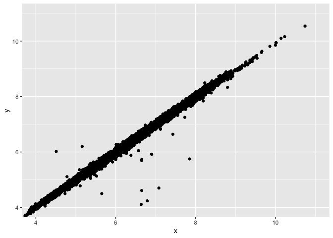

Why is a scatter plot a better display than a binned plot for this case?

- In this case, there is a strong relationship between x and y. There
  are no extreme outliers in either x or y. A binned plot would not
  reveal these outliers, and may lead to think that the largest value of
  x was an outlier even though it fits in with the pattern.
